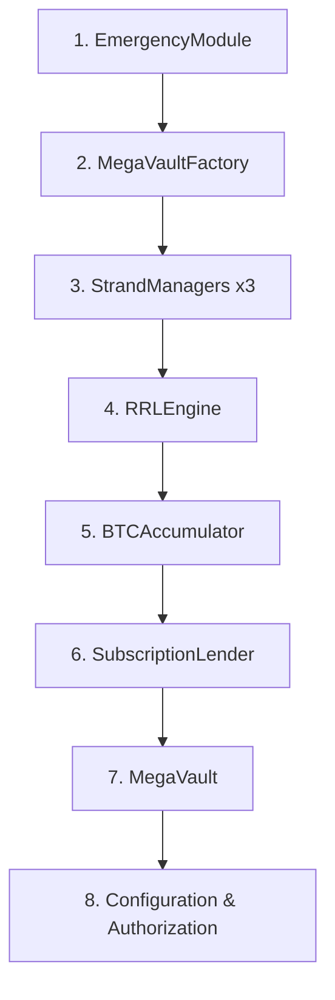

# 🚀 TVC Amoy Testnet Deployment Guide

## Prerequisites

### 1. Environment Setup
- Node.js 16+ installed
- Hardhat development environment configured
- MetaMask or compatible wallet with Amoy testnet configured

### 2. Required Tokens & Keys
- **AMOY tokens** for gas fees (get from [Polygon Faucet](https://faucet.polygon.technology/))
- **Private key** of wallet with AMOY tokens
- **Polygonscan API key** (optional, for contract verification)

### 3. External Protocol Verification
Verify these Amoy testnet addresses are current:
- USDC: `0x41E94Eb019C0762f9Bfcf9Fb1E58725BfB0e7582`
- AAVE Pool: `0x6C9fB0D5bD9429eb9Cd96B85B81d872281771E6B`
- QuickSwap Router: `0x8954AfA98594b838bda56FE4C12a09D7739D179b`
- WBTC: `0x1bfd67037b42cf73acf2047067bd4f2c47d9bfd6`

## Deployment Steps

### Step 1: Configure Environment
```bash
# Copy and edit .env file
cp .env .env.local
nano .env.local
```

Update `.env.local` with:
```env
PRIVATE_KEY=0xYOUR_ACTUAL_PRIVATE_KEY_HERE
POLYGONSCAN_API_KEY=YOUR_POLYGONSCAN_API_KEY
```

### Step 2: Pre-deployment Verification
```bash
# Compile contracts
npm run compile

# Run all tests
npm test

# Check contract sizes
npm run size
```

### Step 3: Deploy to Amoy Testnet
```bash
# Deploy all contracts
npm run deploy:amoy
```

**Expected Output:**
```
🚀 Starting Vault Club deployment to Amoy Testnet...

1. Deploying EmergencyModule...
✅ EmergencyModule deployed to: 0x...

2. Deploying MegaVaultFactory...
✅ MegaVaultFactory deployed to: 0x...

[... continues for all 8 contracts ...]

8. Configuring contracts...
✅ MegaVault set in factory
✅ Contracts authorized in EmergencyModule

✅ Deployment complete! Addresses saved to deployments/amoy-deployment.json

9. Verifying contracts on Polygonscan...
[... verification results ...]
```

### Step 4: Validate Deployment
```bash
# Run comprehensive testnet validation
npx hardhat run scripts/verification/test-testnet.js --network amoy
```

### Step 5: Update Frontend Configuration
After successful deployment, update frontend environment variables:
```bash
# Copy deployed addresses from deployments/amoy-deployment.json
# Update frontend .env with:
REACT_APP_FACTORY_ADDRESS_AMOY=0x...
REACT_APP_MEGA_VAULT_ADDRESS_AMOY=0x...
REACT_APP_RRL_ENGINE_ADDRESS_AMOY=0x...
REACT_APP_BTC_ACCUMULATOR_ADDRESS_AMOY=0x...
```

## Deployment Architecture

The deployment follows this exact order (per technical appendix):



## Post-Deployment Checklist

### ✅ Immediate Verification
- [ ] All 8 contracts deployed successfully
- [ ] Contract verification on Polygonscan completed
- [ ] Deployment addresses saved to `deployments/amoy-deployment.json`
- [ ] Basic functionality tests pass (SubClub creation, MegaVault integration)

### ✅ 7-Day Validation Period
- [ ] Monitor transaction success rates (target: >95%)
- [ ] Test external protocol integrations (AAVE, QuickSwap)
- [ ] Validate gas usage and optimization opportunities
- [ ] Test frontend connectivity with live contracts
- [ ] Verify emergency procedures work correctly

### ✅ Frontend Integration Testing
- [ ] `getVaultBalance()` returns real blockchain data
- [ ] `getVaultStats()` queries live contract state
- [ ] `depositToVault()` executes real transactions
- [ ] `harvestAndRoute()` triggers actual contract calls
- [ ] Error handling works for failed transactions

## Troubleshooting

### Common Issues

**1. Deployment Fails with "insufficient funds"**
- Solution: Ensure wallet has enough AMOY tokens for gas fees

**2. Contract verification fails**
- Solution: Check Polygonscan API key is valid and rate limits not exceeded

**3. External protocol addresses outdated**
- Solution: Verify current Amoy testnet addresses for AAVE, QuickSwap, etc.

**4. Frontend can't connect to contracts**
- Solution: Ensure MetaMask is connected to Amoy testnet and contract addresses are correct

### Gas Usage Estimates
- Total deployment: ~15-20M gas
- Individual contract deployment: 1-3M gas each
- Configuration transactions: ~200K gas each

## Security Considerations

### During Testnet Phase
- Use dedicated testnet wallet (not mainnet wallet)
- Monitor for unusual transaction patterns
- Test emergency pause/unpause functionality
- Validate all access controls work correctly

### Before Mainnet
- Complete CertiK security audit
- Implement monitoring and alerting systems
- Set up multi-sig wallets for admin functions
- Prepare emergency response procedures

## Success Criteria

Deployment is considered successful when:
- ✅ All contracts deployed and verified on Amoy testnet
- ✅ All validation tests pass
- ✅ Frontend fully integrated with live contracts
- ✅ 7 days of stable testnet operation
- ✅ External protocol integrations working
- ✅ Emergency procedures tested and functional

## Next Steps After Successful Testnet

1. **Security Audit**: Engage CertiK or ConsenSys for comprehensive audit
2. **Legal Review**: Ensure compliance with applicable regulations
3. **Mainnet Preparation**: Set up production monitoring and multi-sig wallets
4. **Community Testing**: Allow selected users to test on Amoy testnet
5. **Mainnet Deployment**: Deploy to Polygon mainnet after audit completion

---

**Need Help?** 
- Check deployment logs in `deployments/amoy-deployment.json`
- Review test results in `test-results-testnet.json`
- Monitor transactions on [Amoy Polygonscan](https://amoy.polygonscan.com)
